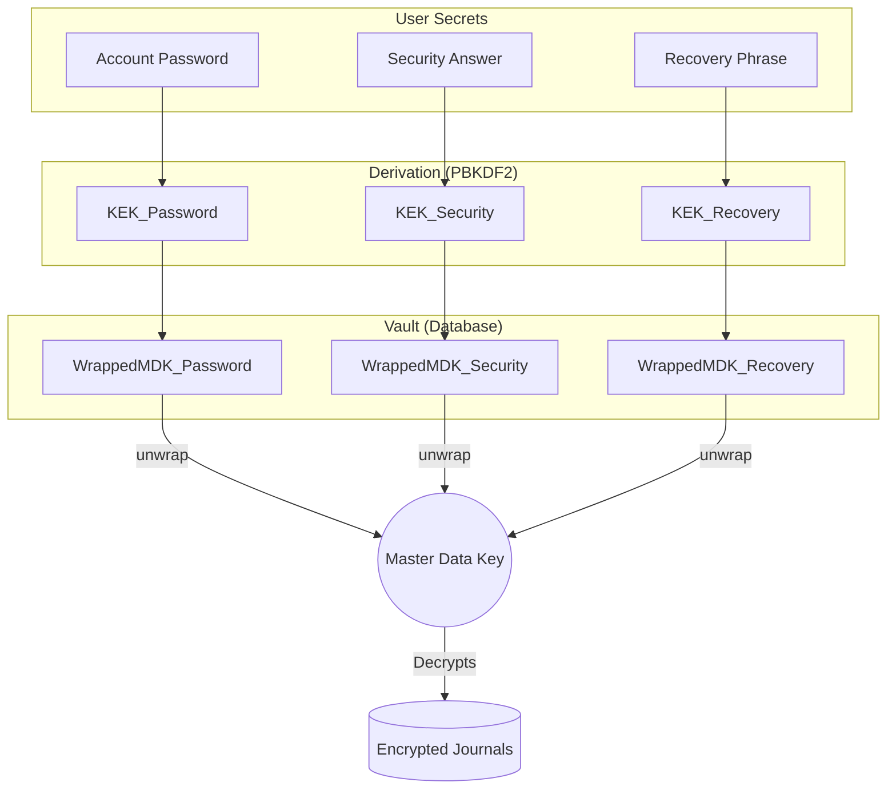

# Brinn Vault Architecture: Technical Specification

This document outlines the evolutionary design and implementation details of the Brinn Security Vault, explaining why we use a multi-layered Key Management System (KMS) instead of traditional single-key encryption.

---

## 1. The Evolution: Why this Architecture?

### Phase 1: The "Naive" Approach (Single Key)
Initially, one might encrypt data directly with a key derived from the user's password.
*   **Mechanism**: `ciphertext = encrypt(data, PBKDF2(password))`
*   **Failure Point**: If the user changes their password, **every single row** in the database must be decrypted and re-encrypted with the new key. Across thousands of journals, this is computationally expensive and high-risk (data loss if the process is interrupted).

### Phase 2: Introducing the MDK (Master Data Key)
To solve the "Password Change" problem, we decouple the data from the user's credentials.
*   **Mechanism**: We generate a high-entropy, random **Master Data Key (MDK)**.
*   **Storage**: The data is encrypted once with the MDK.
*   **Result**: If the user changes their password, we only re-encrypt the 32-byte MDK, not the 32GB of user data.

### Phase 3: Securing the MDK (The KEK)
We cannot store the MDK in plain text. We need to "wrap" it.
*   **Mechanism**: We derive a **Key Encryption Key (KEK)** from the user's password/secret.
*   **Wrapping**: `wrappedMDK = encrypt(MDK, KEK)`
*   **Security**: The MDK never touches the database disk in plain text.

---

## 2. The Final Architecture: The "Multi-Bridge" System

In Brinn, we want the user to be able to unlock their vault using different "paths" (Password, Security Answer, or Recovery Phrase). To achieve this, we store **multiple wrappers** for the same MDK.

### Core Benefits:
1.  **Zero-Knowledge**: The server never knows the MDK or the Password. It only sees "Wrappers."
2.  **Atomic Recovery**: If you forget your password but remember your Security Answer, you can unwrap the MDK and regenerate a new Password wrapper.
3.  **High Performance**: Symmetric encryption happens once; re-keying happens only at the wrapper level.

---

## 3. Implementation Details

### A. Key Derivation (KEK)
We use a hardened derivation function to convert low-entropy human secrets into high-entropy 256-bit keys.
*   **Algorithm**: `scrypt` or `PBKDF2-HMAC-SHA256`
*   **Normalization**: All secrets are strictly `trim().toLowerCase()` before derivation to ensure consistency.

### B. Key Wrapping
We use **AES-256-GCM** for wrapping the MDK.
*   **Input**: 32-byte random MDK.
*   **Output**: A JSON string containing `{ ciphertext, iv, authTag }`.

### C. The Session Bridge (Redis)
To avoid asking for credentials on every API call (which would be a UX nightmare), we use a "Secure Session Cache."
1.  User Unlocks -> MDK is unwrapped in memory.
2.  MDK is stored in **Redis** with a specific TTL.
    *   **Lock ON**: 15 Minute TTL (refreshed on activity).
    *   **Lock OFF**: 24 Hour TTL (matching Auth session).
3.  API Requests -> Middleware retrieves MDK from Redis to decrypt rows.

### D. Security Answer "Hard-Sync" (The Patch)
The most critical part of this architecture is **Synchronization**.
When a user updates their security answer:
1.  We must have the **plain MDK** in the current session.
2.  We generate a new `securityAnswerSalt`.
3.  We derive a new `KEK_Security`.
4.  We wrap the MDK with the new KEK.
5.  We update the user's `answerHash` (for UI auth) AND the `wrappedMDK_securityAnswer` (for data access) **atomically**.

---

## 4. Disaster Recovery
If all wrappers are lost (unlikely), the **Recovery Phrase** is the "Skeleton Key." It is a BIP-39 mnemonic that acts as a raw secret which always has a valid wrapper generated during vault initialization. This ensures that even if the user changes both password and security answer and forgets them, the data remains recoverable via the offline phrase.
