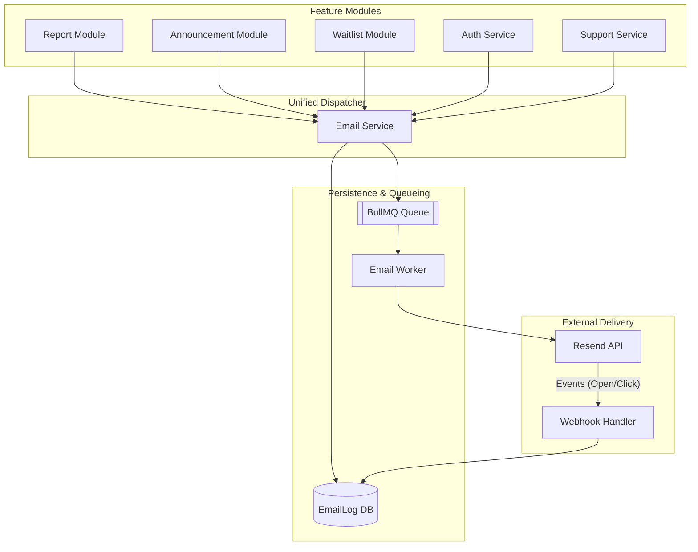

# 📧 Brinn Email Delivery & Tracking System

## Overview
The Brinn Email System is a robust, unified communication engine designed for high reliability, asynchronous delivery, and granular engagement tracking. It serves as the single transport layer for all platform communications, including authentication, reports, announcements, and support.

---

## 🏗️ Architectural Diagram

---

## 🧩 Core Components

### 1. EmailService (`src/features/email/email.service.ts`)
The primary entry point for all features. It abstracts the complexity of creating logs and managing the queue.
- **`sendSystemEmail`**: Standard transactional emails with predefined local templates.
- **`sendTemplatedEmail`**: Dynamic emails using admin-managed templates stored in the database.
- **`sendBulkEmails`**: Optimized for mass dispatches (Announcements), handling batching and large recipient lists.
- **`sendCustomEmail`**: Ad-hoc emails used by reports and support staff.

### 2. EmailLog Model (`src/features/email/models/email-log.model.ts`)
Persistent storage for every communication attempt.
- **Statuses**: `PENDING`, `QUEUED`, `SENDING`, `SENT`, `DELIVERED`, `OPENED`, `CLICKED`, `FAILED`, `BOUNCED`, `SPAM`.
- **Metadata**: Stores contextual IDs (like `announcementId`) to link logs back to their source features.

### 3. Email Worker (`src/features/email/queue/email.worker.ts`)
An isolated process that consumes jobs from Redis.
- **Template Rendering**: Merges template data with HTML layouts.
- **Provider Switching**: Routes traffic through the configured `EmailProvider` (Resend).
- **Retry Logic**: Automatically retries failed jobs with exponential backoff and moves permanent failures to a **Dead Letter Queue (DLQ)**.

### 4. Webhook Handler (`src/features/email/email.controller.ts`)
Handles real-time feedback from the email provider.
- Updates engagement metrics (`openedAt`, `clickedAt`) asynchronously.

---

## 🔄 Lifecycle of an Email

1.  **Request**: A feature (e.g., `ReportService`) calls `emailService.sendCustomEmail()`.
2.  **Log Creation**: A record is created in `EmailLogs` with status `PENDING`.
3.  **Queueing**: The job is added to **BullMQ** with the `logId`.
4.  **Status Update**: Log status moves to `QUEUED`.
5.  **Pickup**: High-priority worker picks up the job, moves status to `SENDING`.
6.  **Delivery**: Worker communicates with **Resend API**.
7.  **Finalize**: Upon success, status moves to `SENT` and `providerMessageId` is stored.
8.  **Tracking**: If the user opens the email, Resend pings the `/api/emails/webhook/resend` endpoint, and the log is marked as `OPENED`.

---

## 🛠️ Management for Admins

Admin users can manage the system via:
- **Routes**: `/api/emails/logs` (Viewing delivery history)
- **Routes**: `/api/emails/templates` (CRUD operations for marketing templates)
- **Monitoring**: BullMQ dashboard for queue health.

---

## ⚖️ Quality Standards
- **Validation**: All emails are validated for RFC compliance before queueing.
- **Sanitization**: HTML content is sanitized using DOMPurify before storage/dispatch.
- **Type Safety**: Centralized `EmailJob` interfaces prevent malformed payloads.
